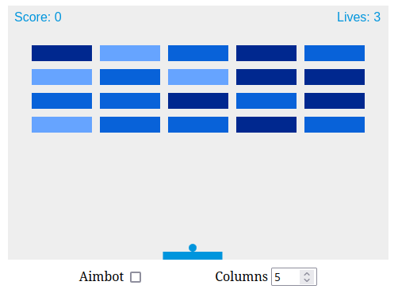

# Arkanoid Game

This is a web-based implementation of the classic Arkanoid game. It's built using HTML, CSS, and JavaScript.

## Description

This Arkanoid game allows you to control a paddle with the arrow keys or mouse to bounce a ball up and break bricks. The game includes features such as an aimbot and adjustable number of columns for the bricks.

You can play the game [installing](#installation) the project in your machine or directly play it [here](https://r0zh.github.io/Arkanoid/) 

## Installation

1. Clone this repository to your local machine.
2. Navigate to the project directory.
3. Serve the project using a local server.

   - If you have Node.js installed, you can install `http-server` by running `npm install --global http-server`. Then, start the server with `http-server .`
   - If you're using Visual Studio Code, you can install the "Live Server" extension and use it to serve your project.
   
4. Open your web browser and go to `http://localhost:8080` (or the appropriate address if your server uses a different port).

## Usage

To play the game:

1. Use the left and right arrow keys or move your mouse to control the paddle.
2. Press the spacebar to launch the ball.
3. Break all the bricks to win the game.

You can also adjust the game settings:

- **Aimbot**: Check this box to enable the aimbot, which automatically moves the paddle to hit the ball.
- **Columns**: Adjust this number to change the number of brick columns.

## Code Structure

The game logic is divided into several JavaScript files:

- `game.js`: Contains the main game loop and overall game logic.
- `draw.js`: Handles drawing the game elements on the canvas.
- `collision.js`: Handles collisions between the ball and other game elements.
- `controls.js`: Handles user input and controlling the game.
- `bricks.js`: Handles creating and managing the bricks in the game.

## License

This project is open source, under the [MIT License](./LICENSE).
